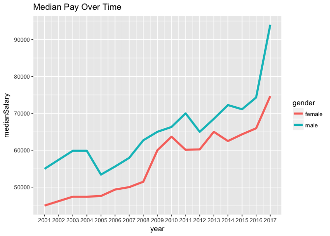
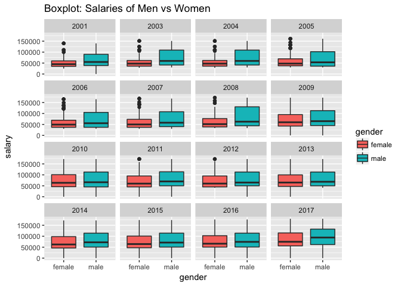

White House Salary Gender Analysis
================
08-09-2017

Comparing Salaries between male and female White House Staff Members
--------------------------------------------------------------------

[American Progress Analysis](https://www.americanprogress.org/issues/economy/reports/2014/05/19/90039/explaining-the-gender-wage-gap/)

Recently I thought it would be interesting to see if men and women in The White House receive equal pay and what those trends are over time.

For this analysis, I'll be relying heavily on the `gender` package in R to assume the gender identity of each name based on the dataset provided.

I have not taken the time to spot check each time, but if you're interested in teaming up and tackling it, [please let me know](http://www.twitter.com/chipoglesby)!

First let's simply start with visualizing pay between gender over time:

As we've seen in earlier in my first analysis, median salaries are on the rise year over year.

