Staff Term Length
================
08-09-2017

How long does the average employee stay on staff?
-------------------------------------------------

Let's start by looking at the average employee length of stay between 2001 and 2017.

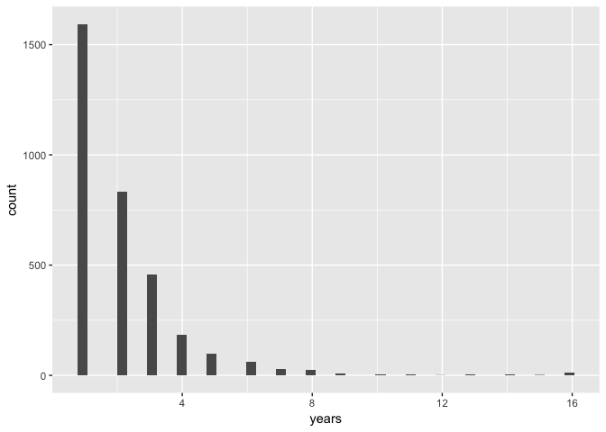

It looks like the majority of employees will only work one year and there also appears to be a handful who have worked as many as 16 years. We'll investigate that later.

Next, let's take at look at the top positions with the highest turnover. These positions have the highest count of employees who only work one year.

| position                                                   |  count|
|:-----------------------------------------------------------|------:|
| staff assistant                                            |    160|
| associate director                                         |     66|
| executive assistant                                        |     54|
| deputy associate director                                  |     48|
| senior policy advisor                                      |     37|
| analyst                                                    |     28|
| associate counsel to the president                         |     25|
| deputy associate counsel for presidential personnel        |     25|
| ethics advisor                                             |     25|
| correspondence analyst                                     |     22|
| special assistant to the president for legislative affairs |     22|

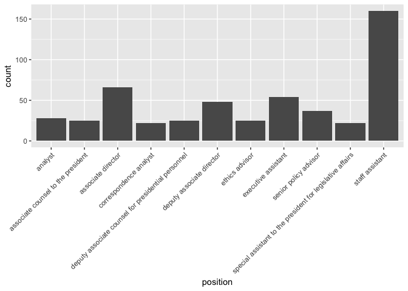

Longest Employed Staff
----------------------

One interesting nugget of data that I've found during my analysis is that some staffers have worked as many as 16 years in the White House. I thought it would be interesting to look more at these people and staff overall.

Here I am going to make the assumption that the people listed below are the same people, because they've held the same or similiar positions over time.

| employee\_name       |  years|
|:---------------------|------:|
| brooke, mary j       |     16|
| campbell, frances l  |     16|
| droege, philip c     |     16|
| jones, crystal b     |     16|
| kalbaugh, david e    |     16|
| mattson, philip c    |     16|
| mccathran, william w |     16|
| roddick, gertrude a  |     16|
| trainor, gregory t   |     16|
| tucker, phyllis j    |     16|
| williams, sherman a  |     16|

That's interesting, right? 11 people have been working in The White House for 16 years now. I wonder what they do there?

Let's take a deeper dive into the data:

| employee\_name       |  year| position                                                       | president |
|:---------------------|-----:|:---------------------------------------------------------------|:----------|
| brooke, mary j       |  2001| records management analyst                                     | bush      |
| brooke, mary j       |  2003| supervisor, correspondence review unit                         | bush      |
| brooke, mary j       |  2004| supervisor, correspondence review unit                         | bush      |
| brooke, mary j       |  2005| supervisor of correspondence review                            | bush      |
| brooke, mary j       |  2006| supervisor of correspondence review                            | bush      |
| brooke, mary j       |  2007| supervisor of correspondence review                            | bush      |
| brooke, mary j       |  2008| supervisor of correspondence review                            | bush      |
| brooke, mary j       |  2009| supervisor of correspondence review                            | obama     |
| brooke, mary j       |  2010| supervisor of correspondence review                            | obama     |
| brooke, mary j       |  2011| supervisor of correspondence review                            | obama     |
| brooke, mary j       |  2012| supervisor of correspondence review                            | obama     |
| brooke, mary j       |  2013| supervisor of correspondence review                            | obama     |
| brooke, mary j       |  2014| supervisor of correspondence review                            | obama     |
| brooke, mary j       |  2015| supervisor of correspondence review                            | obama     |
| brooke, mary j       |  2016| supervisor of correspondence review                            | obama     |
| brooke, mary j       |  2017| supervisor of correspondence review                            | trump     |
| campbell, frances l  |  2001| supervisor, data entry unit                                    | bush      |
| campbell, frances l  |  2003| supervisor data entry unit                                     | bush      |
| campbell, frances l  |  2004| supervisor data entry unit                                     | bush      |
| campbell, frances l  |  2005| supervisor of data entry                                       | bush      |
| campbell, frances l  |  2006| supervisor of data entry                                       | bush      |
| campbell, frances l  |  2007| supervisor of data entry                                       | bush      |
| campbell, frances l  |  2008| supervisor, document management and tracking unit              | bush      |
| campbell, frances l  |  2009| supervisor, document management and tracking unit              | obama     |
| campbell, frances l  |  2010| supervisor, document management and tracking unit              | obama     |
| campbell, frances l  |  2011| supervisor, document management and tracking unit              | obama     |
| campbell, frances l  |  2012| supervisor, document management and tracking unit              | obama     |
| campbell, frances l  |  2013| supervisor, document management and tracking unit              | obama     |
| campbell, frances l  |  2014| supervisor, document management and tracking unit              | obama     |
| campbell, frances l  |  2015| supervisor, document management and tracking unit              | obama     |
| campbell, frances l  |  2016| supervisor, document management and tracking unit              | obama     |
| campbell, frances l  |  2017| supervisor for document management and tracking unit           | trump     |
| droege, philip c     |  2001| supervisor, correspondence review unit                         | bush      |
| droege, philip c     |  2003| deputy director, office of records management                  | bush      |
| droege, philip c     |  2004| deputy director, office of records management                  | bush      |
| droege, philip c     |  2005| director of records management                                 | bush      |
| droege, philip c     |  2006| director of records management                                 | bush      |
| droege, philip c     |  2007| director of records management                                 | bush      |
| droege, philip c     |  2008| director of records management                                 | bush      |
| droege, philip c     |  2009| director of records management                                 | obama     |
| droege, philip c     |  2010| director of records management                                 | obama     |
| droege, philip c     |  2011| director of records management                                 | obama     |
| droege, philip c     |  2012| director of records management                                 | obama     |
| droege, philip c     |  2013| director of records management                                 | obama     |
| droege, philip c     |  2014| director of records management                                 | obama     |
| droege, philip c     |  2015| director of records management                                 | obama     |
| droege, philip c     |  2016| director of records management                                 | obama     |
| droege, philip c     |  2017| director of records management                                 | trump     |
| jones, crystal b     |  2001| records management analyst                                     | bush      |
| jones, crystal b     |  2003| assistant supervisor, data entry unit                          | bush      |
| jones, crystal b     |  2004| assistant supervisor, data entry unit                          | bush      |
| jones, crystal b     |  2005| assistant supervisor of data entry                             | bush      |
| jones, crystal b     |  2006| assistant supervisor of data entry                             | bush      |
| jones, crystal b     |  2007| assistant supervisor of data entry                             | bush      |
| jones, crystal b     |  2008| assistant supervisor document management and tracking unit     | bush      |
| jones, crystal b     |  2009| assistant supervisor, document management and tracking unit    | obama     |
| jones, crystal b     |  2010| assistant supervisor, document management and tracking unit    | obama     |
| jones, crystal b     |  2011| assistant supervisor, document management and tracking unit    | obama     |
| jones, crystal b     |  2012| assistant supervisor, document management and tracking unit    | obama     |
| jones, crystal b     |  2013| assistant supervisor, document management and tracking unit    | obama     |
| jones, crystal b     |  2014| assistant supervisor, document management and tracking unit    | obama     |
| jones, crystal b     |  2015| assistant supervisor, document management and tracking unit    | obama     |
| jones, crystal b     |  2016| assistant supervisor, document management and tracking unit    | obama     |
| jones, crystal b     |  2017| assistant supervisor for document management and tracking unit | trump     |
| kalbaugh, david e    |  2001| deputy executive clerk                                         | bush      |
| kalbaugh, david e    |  2003| deputy executive clerk                                         | bush      |
| kalbaugh, david e    |  2004| deputy executive clerk                                         | bush      |
| kalbaugh, david e    |  2005| deputy executive clerk                                         | bush      |
| kalbaugh, david e    |  2006| deputy executive clerk                                         | bush      |
| kalbaugh, david e    |  2007| deputy executive clerk                                         | bush      |
| kalbaugh, david e    |  2008| deputy executive clerk                                         | bush      |
| kalbaugh, david e    |  2009| deputy executive clerk                                         | obama     |
| kalbaugh, david e    |  2010| deputy executive clerk                                         | obama     |
| kalbaugh, david e    |  2011| deputy executive clerk                                         | obama     |
| kalbaugh, david e    |  2012| executive clerk                                                | obama     |
| kalbaugh, david e    |  2013| executive clerk                                                | obama     |
| kalbaugh, david e    |  2014| executive clerk                                                | obama     |
| kalbaugh, david e    |  2015| executive clerk                                                | obama     |
| kalbaugh, david e    |  2016| executive clerk                                                | obama     |
| kalbaugh, david e    |  2017| executive clerk                                                | trump     |
| mattson, philip c    |  2001| printer                                                        | bush      |
| mattson, philip c    |  2003| printer and photograph coordinator                             | bush      |
| mattson, philip c    |  2004| printer and photograph coordinator                             | bush      |
| mattson, philip c    |  2005| printer and photograph coordinator                             | bush      |
| mattson, philip c    |  2006| printer and photograph coordinator                             | bush      |
| mattson, philip c    |  2007| printer and photograph coordinator                             | bush      |
| mattson, philip c    |  2008| printer and photograph coordinator                             | bush      |
| mattson, philip c    |  2009| printer and photograph coordinator                             | obama     |
| mattson, philip c    |  2010| special assistant                                              | obama     |
| mattson, philip c    |  2011| special assistant                                              | obama     |
| mattson, philip c    |  2012| special assistant                                              | obama     |
| mattson, philip c    |  2013| special assistant                                              | obama     |
| mattson, philip c    |  2014| special assistant                                              | obama     |
| mattson, philip c    |  2015| special assistant                                              | obama     |
| mattson, philip c    |  2016| special assistant                                              | obama     |
| mattson, philip c    |  2017| director of mail analysis                                      | trump     |
| mccathran, william w |  2001| assistant executive clerk                                      | bush      |
| mccathran, william w |  2003| assistant executive clerk                                      | bush      |
| mccathran, william w |  2004| assistant executive clerk                                      | bush      |
| mccathran, william w |  2005| assistant executive clerk                                      | bush      |
| mccathran, william w |  2006| assistant executive clerk                                      | bush      |
| mccathran, william w |  2007| assistant executive clerk                                      | bush      |
| mccathran, william w |  2008| assistant executive clerk                                      | bush      |
| mccathran, william w |  2009| assistant executive clerk                                      | obama     |
| mccathran, william w |  2010| assistant executive clerk                                      | obama     |
| mccathran, william w |  2011| assistant executive clerk                                      | obama     |
| mccathran, william w |  2012| assistant executive clerk                                      | obama     |
| mccathran, william w |  2013| assistant executive clerk                                      | obama     |
| mccathran, william w |  2014| assistant executive clerk                                      | obama     |
| mccathran, william w |  2015| assistant executive clerk                                      | obama     |
| mccathran, william w |  2016| assistant executive clerk                                      | obama     |
| mccathran, william w |  2017| assistant executive clerk                                      | trump     |
| roddick, gertrude a  |  2001| director, mail analysis                                        | bush      |
| roddick, gertrude a  |  2003| director, mail analysis                                        | bush      |
| roddick, gertrude a  |  2004| director, mail analysis                                        | bush      |
| roddick, gertrude a  |  2005| director of mail analysis                                      | bush      |
| roddick, gertrude a  |  2006| director of mail analysis                                      | bush      |
| roddick, gertrude a  |  2007| director of mail analysis                                      | bush      |
| roddick, gertrude a  |  2008| director of mail analysis                                      | bush      |
| roddick, gertrude a  |  2009| assistant director of correspondence for mail analysis         | obama     |
| roddick, gertrude a  |  2010| special assistant                                              | obama     |
| roddick, gertrude a  |  2011| special assistant                                              | obama     |
| roddick, gertrude a  |  2012| presidential support specialist                                | obama     |
| roddick, gertrude a  |  2013| presidential support specialist                                | obama     |
| roddick, gertrude a  |  2014| presidential support specialist                                | obama     |
| roddick, gertrude a  |  2015| presidential support specialist                                | obama     |
| roddick, gertrude a  |  2016| presidential support specialist                                | obama     |
| roddick, gertrude a  |  2017| presidential support specialist                                | trump     |
| trainor, gregory t   |  2001| manager, data entry                                            | bush      |
| trainor, gregory t   |  2003| manager, data entry                                            | bush      |
| trainor, gregory t   |  2004| manager, data entry                                            | bush      |
| trainor, gregory t   |  2005| manager of mail and messenger operations                       | bush      |
| trainor, gregory t   |  2006| manager of mail and messenger operations                       | bush      |
| trainor, gregory t   |  2007| manager of mail and messenger operations                       | bush      |
| trainor, gregory t   |  2008| manager of mail and messenger operations                       | bush      |
| trainor, gregory t   |  2009| manager of mail and messenger operations                       | obama     |
| trainor, gregory t   |  2010| special assistant                                              | obama     |
| trainor, gregory t   |  2011| special assistant                                              | obama     |
| trainor, gregory t   |  2012| special assistant                                              | obama     |
| trainor, gregory t   |  2013| special assistant                                              | obama     |
| trainor, gregory t   |  2014| special assistant                                              | obama     |
| trainor, gregory t   |  2015| special assistant                                              | obama     |
| trainor, gregory t   |  2016| special assistant                                              | obama     |
| trainor, gregory t   |  2017| NA                                                             | trump     |
| tucker, phyllis j    |  2001| records management analyst                                     | bush      |
| tucker, phyllis j    |  2003| assistant supervisor, optical disk unit                        | bush      |
| tucker, phyllis j    |  2004| assistant supervisor, optical disk unit                        | bush      |
| tucker, phyllis j    |  2005| supervisor of computer administration                          | bush      |
| tucker, phyllis j    |  2006| supervisor of computer administration                          | bush      |
| tucker, phyllis j    |  2007| supervisor of computer administration                          | bush      |
| tucker, phyllis j    |  2008| supervisor of computer administration                          | bush      |
| tucker, phyllis j    |  2009| supervisor of computer administration                          | obama     |
| tucker, phyllis j    |  2010| supervisor of computer administration                          | obama     |
| tucker, phyllis j    |  2011| supervisor of computer administration                          | obama     |
| tucker, phyllis j    |  2012| supervisor of computer administration                          | obama     |
| tucker, phyllis j    |  2013| supervisor of computer administration                          | obama     |
| tucker, phyllis j    |  2014| supervisor of computer administration                          | obama     |
| tucker, phyllis j    |  2015| supervisor of computer administration                          | obama     |
| tucker, phyllis j    |  2016| supervisor of computer administration                          | obama     |
| tucker, phyllis j    |  2017| supervisor of computer administration for records management   | trump     |
| williams, sherman a  |  2001| assistant to the executive clerk                               | bush      |
| williams, sherman a  |  2003| assistant to the executive clerk                               | bush      |
| williams, sherman a  |  2004| assistant to the executive clerk                               | bush      |
| williams, sherman a  |  2005| assistant to the executive clerk                               | bush      |
| williams, sherman a  |  2006| assistant to the executive clerk                               | bush      |
| williams, sherman a  |  2007| assistant to the executive clerk                               | bush      |
| williams, sherman a  |  2008| assistant to the executive clerk                               | bush      |
| williams, sherman a  |  2009| assistant to the executive clerk                               | obama     |
| williams, sherman a  |  2010| assistant to the executive clerk                               | obama     |
| williams, sherman a  |  2011| assistant to the executive clerk                               | obama     |
| williams, sherman a  |  2012| assistant to the executive clerk                               | obama     |
| williams, sherman a  |  2013| assistant to the executive clerk                               | obama     |
| williams, sherman a  |  2014| assistant to the executive clerk                               | obama     |
| williams, sherman a  |  2015| assistant to the executive clerk                               | obama     |
| williams, sherman a  |  2016| assistant to the executive clerk                               | obama     |
| williams, sherman a  |  2017| assistant to the executive clerk                               | trump     |

Visualizing Employee Tenure
---------------------------

It would be interesting to know if those 11 are compensatated properly for their tenure while working at The White House?

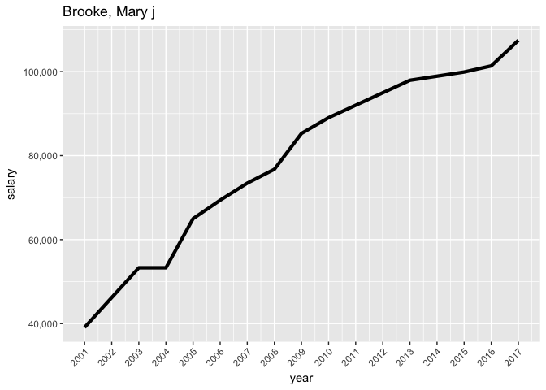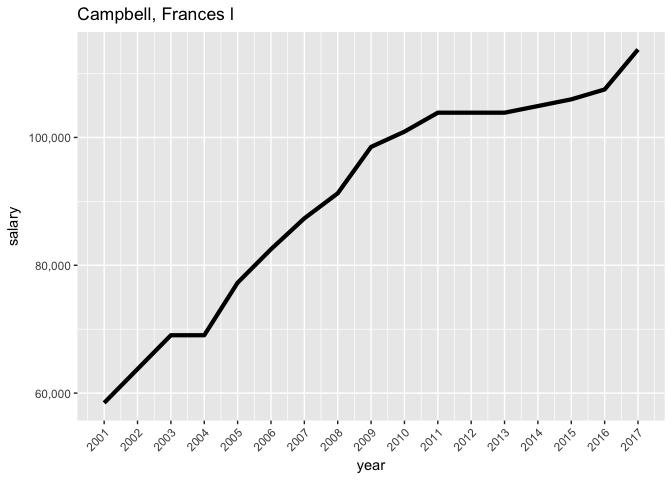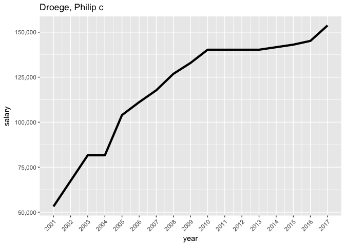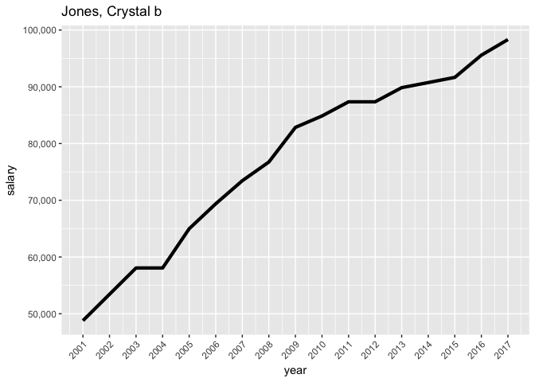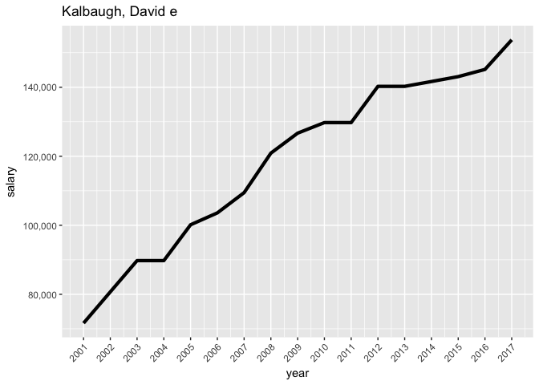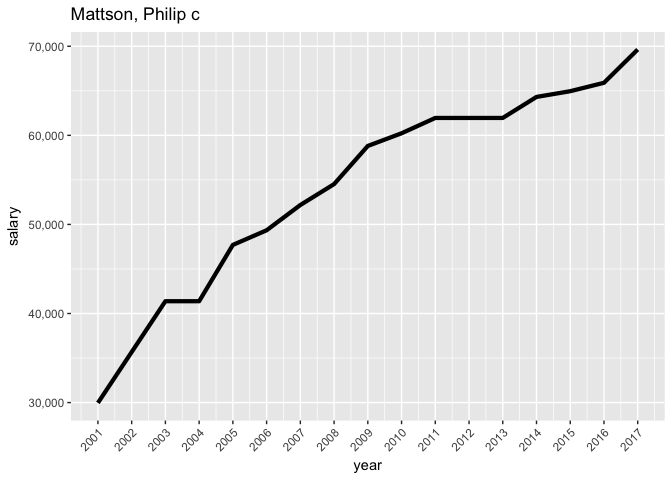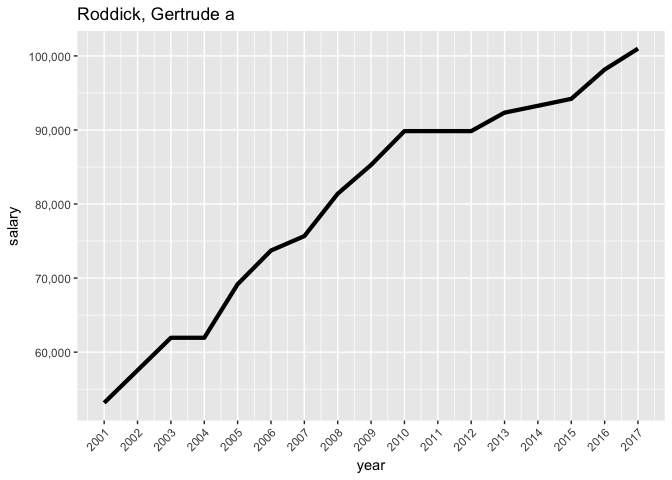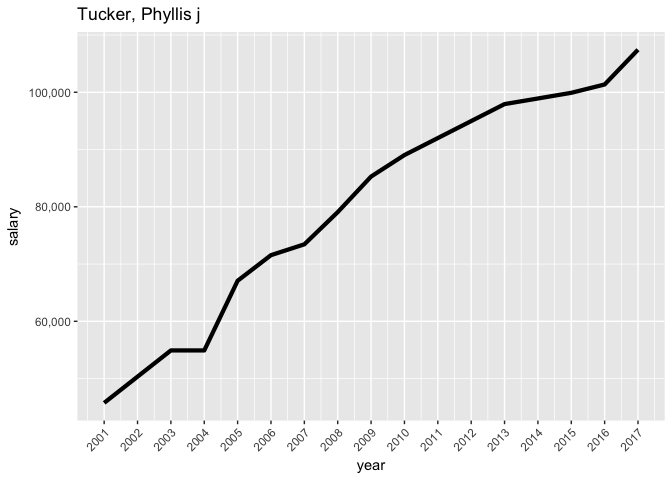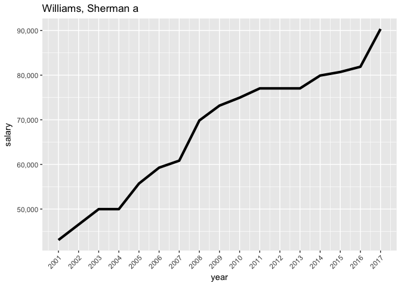
